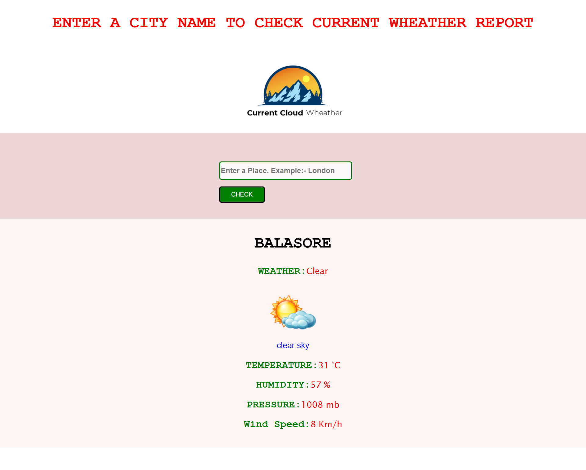

# Know-Your-City-Weather

1. Create a virtual environment using py -m venv environment_name
2. Activate that virtual environment using
   ./environment_name/Scripts/activate
3. Install all the required modules using
   pip install -r requirements.txt
4. Run the flask Application using flask run
5. In the console window you will get the url of your website

# API used

https://api.openweathermap.org/

# Screenshot

